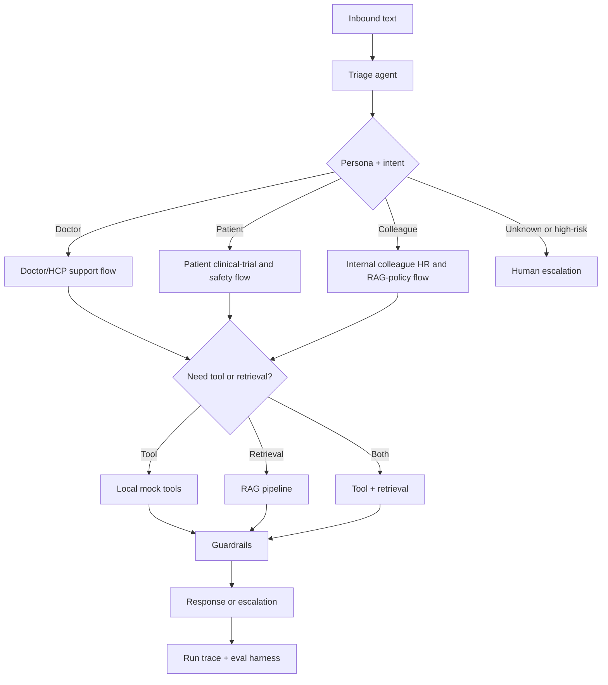
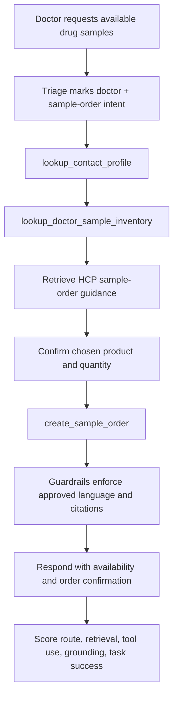
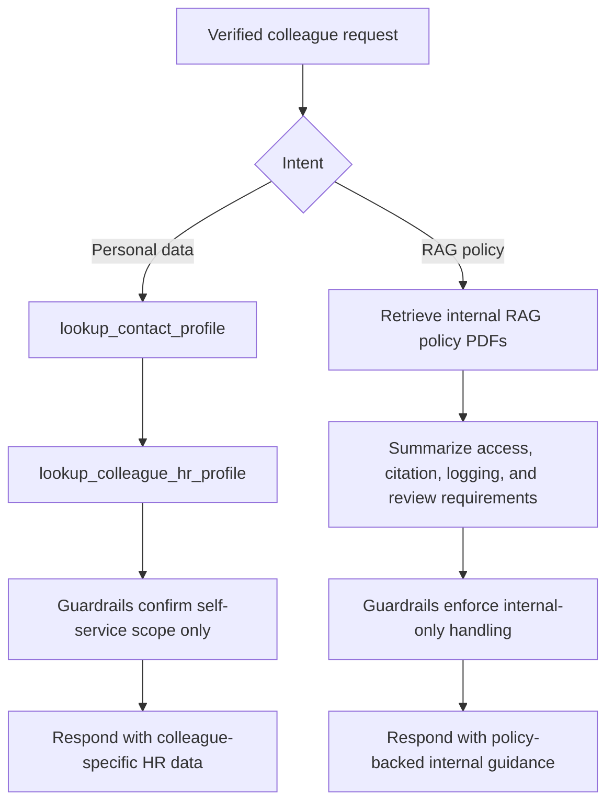
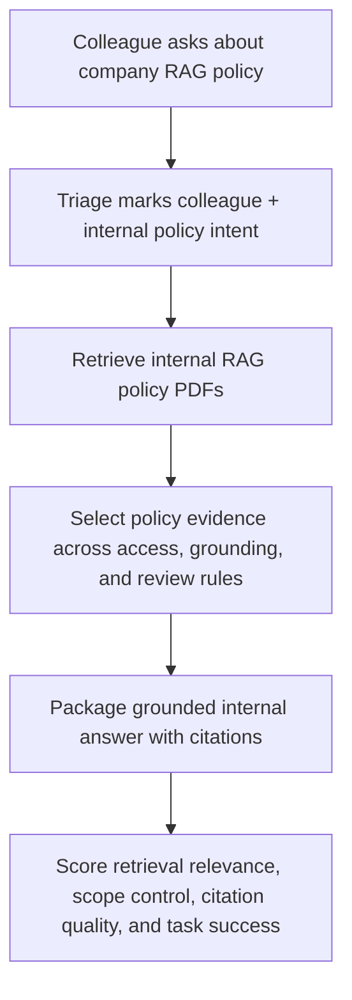

# Flow Diagrams

## System-Level Flow

```mermaid
flowchart TD
    A["Inbound text"] --> B["Triage agent"]
    B --> C{"Persona + intent"}
    C -->|Doctor| D["Doctor/HCP support flow"]
    C -->|Patient| E["Patient clinical-trial and safety flow"]
    C -->|Colleague| F["Internal colleague HR and RAG-policy flow"]
    C -->|Unknown or high-risk| G["Human escalation"]

    D --> H{"Need tool or retrieval?"}
    E --> H
    F --> H

    H -->|Tool| I["Local mock tools"]
    H -->|Retrieval| J["RAG pipeline"]
    H -->|Both| K["Tool + retrieval"]

    I --> L["Guardrails"]
    J --> L
    K --> L
    L --> M["Response or escalation"]
    M --> N["Run trace + eval harness"]
```

## Flagship Doctor Sample-Order Flow

```mermaid
flowchart TD
    A["Doctor requests available drug samples"] --> B["Triage marks doctor + sample-order intent"]
    B --> C["lookup_contact_profile"]
    C --> D["lookup_doctor_sample_inventory"]
    D --> E["Retrieve HCP sample-order guidance"]
    E --> F["Confirm chosen product and quantity"]
    F --> G["create_sample_order"]
    G --> H["Guardrails enforce approved language and citations"]
    H --> I["Respond with availability and order confirmation"]
    I --> J["Score route, retrieval, tool use, grounding, task success"]
```

## Colleague Internal Operations Flow

```mermaid
flowchart TD
    A["Verified colleague request"] --> B{"Intent"}
    B -->|Personal data| C["lookup_contact_profile"]
    C --> D["lookup_colleague_hr_profile"]
    D --> E["Guardrails confirm self-service scope only"]
    E --> F["Respond with colleague-specific HR data"]
    B -->|RAG policy| G["Retrieve internal RAG policy PDFs"]
    G --> H["Summarize access, citation, logging, and review requirements"]
    H --> I["Guardrails enforce internal-only handling"]
    I --> J["Respond with policy-backed internal guidance"]
```

## Main Internal RAG Policy Flow

```mermaid
flowchart TD
    A["Colleague asks about company RAG policy"] --> B["Triage marks colleague + internal policy intent"]
    B --> C["Retrieve internal RAG policy PDFs"]
    C --> D["Select policy evidence across access, grounding, and review rules"]
    D --> E["Package grounded internal answer with citations"]
    E --> F["Score retrieval relevance, scope control, citation quality, and task success"]
```

## RAG Pipeline Flow

```mermaid
flowchart LR
    A["Raw source docs"] --> B["Source registration"]
    B --> C["Document parsing"]
    C --> D["Normalization"]
    D --> E["Structured enrichment"]
    E --> F["Chunking"]
    F --> G["Index preparation"]
    G --> H["Retrieval with persona/policy filters"]
    H --> I["Selection or reranking"]
    I --> J["Grounded response packaging"]
    J --> K["Eval hooks"]
```
