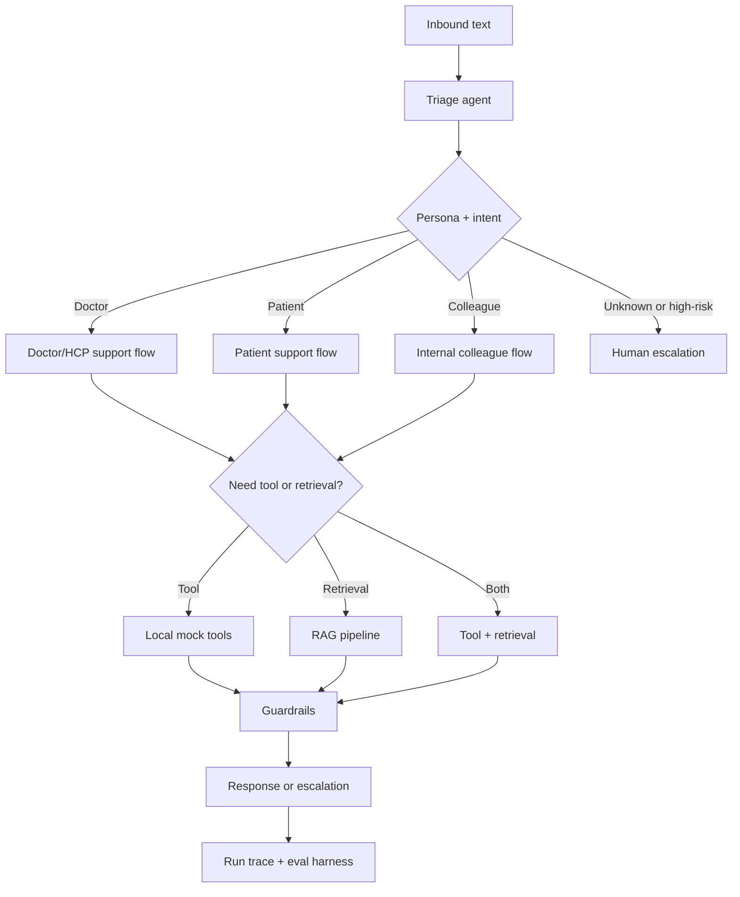
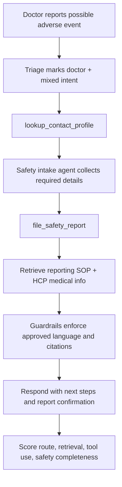

# Flow Diagrams

## System-Level Flow

```mermaid
flowchart TD
    A["Inbound text"] --> B["Triage agent"]
    B --> C{"Persona + intent"}
    C -->|Doctor| D["Doctor/HCP support flow"]
    C -->|Patient| E["Patient support flow"]
    C -->|Colleague| F["Internal colleague flow"]
    C -->|Unknown or high-risk| G["Human escalation"]

    D --> H{"Need tool or retrieval?"}
    E --> H
    F --> H

    H -->|Tool| I["Local mock tools"]
    H -->|Retrieval| J["RAG pipeline"]
    H -->|Both| K["Tool + retrieval"]

    I --> L["Guardrails"]
    J --> L
    K --> L
    L --> M["Response or escalation"]
    M --> N["Run trace + eval harness"]
```

## Flagship Doctor Adverse-Event Flow

```mermaid
flowchart TD
    A["Doctor reports possible adverse event"] --> B["Triage marks doctor + mixed intent"]
    B --> C["lookup_contact_profile"]
    C --> D["Safety intake agent collects required details"]
    D --> E["file_safety_report"]
    E --> F["Retrieve reporting SOP + HCP medical info"]
    F --> G["Guardrails enforce approved language and citations"]
    G --> H["Respond with next steps and report confirmation"]
    H --> I["Score route, retrieval, tool use, safety completeness"]
```

## RAG Pipeline Flow

```mermaid
flowchart LR
    A["Raw source docs"] --> B["Source registration"]
    B --> C["Document parsing"]
    C --> D["Normalization"]
    D --> E["Structured enrichment"]
    E --> F["Chunking"]
    F --> G["Index preparation"]
    G --> H["Retrieval with persona/policy filters"]
    H --> I["Selection or reranking"]
    I --> J["Grounded response packaging"]
    J --> K["Eval hooks"]
```